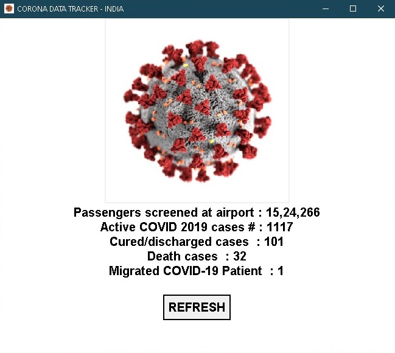
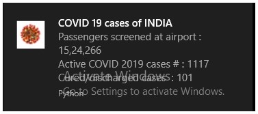

# Corona_Status_INDIA
A python project that gives real-time stats of COVID-19(Corona Virus) in INDIA. 
Using requests, bs4, tkinter, plyer, time and threading libraries.

Screenshot of App :

Screenshot of Notification :

